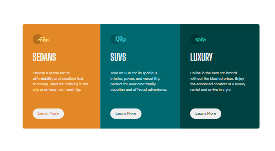
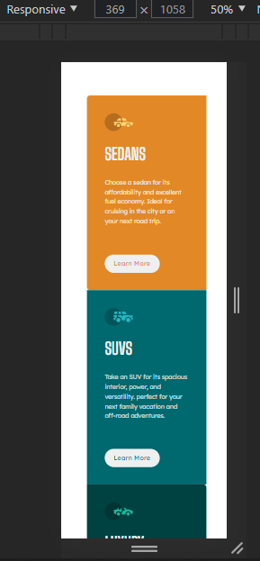

# Frontend Mentor - 3-column preview card component solution

This is a solution to the [3-column preview card component challenge on Frontend Mentor](https://www.frontendmentor.io/challenges/3column-preview-card-component-pH92eAR2-). Frontend Mentor challenges help you improve your coding skills by building realistic projects. 

## Table of contents

  - [The challenge](#the-challenge)
  - [Screenshot](#screenshot)
  - [My process](#my-process)
  - [Built with](#built-with)
  - [What I learned](#what-i-learned)
  - [Useful resources](#useful-resources)
  - [Author](#author)

## General description
Make some block cards, giving each one a style

### The challenge
Given an image and some basic criteria, a block card with a unique style, colors and logo should be made.

### Screenshot

### Desktop

### Movil

### Links

- Solution URL: [Add solution URL here] (https://mimolmon.github.io/Frontend_Mentor/)
- Live Site URL: [Add Live Site URL Here] (https://mimolmon.github.io/Frontend_Mentor/)

## My process

Make a drawing on an agenda to determine the spaces, properties and classes that you needed, determine the headings, logos, buttons and paragraphs to use

### Built with

- HTML5 semantic markup
- CSS custom properties
- Flexible box

### What I learned

The power to assimilate and structure a project in the simplest way possible

### Continuous development

The process of aligning and distributing the spaces that is what I should focus on

### Helpful Resources

- [Responsive] (https://www.genbeta.com/desarrollo/responsive-design-estructura-adaptable) - This gave me a base to use the media-queries

## Author

- Website - [Milena Montoya] (https://www.your-site.com)
- Frontend Mentor - [@mimolmon] (https://www.frontendmentor.io/profile/mimolmon)
- Twitter - [@mimolmon] (https://twitter.com/mimolmon)

## Thanks

Thanks to Frontend Mentor for allowing these practice spaces
